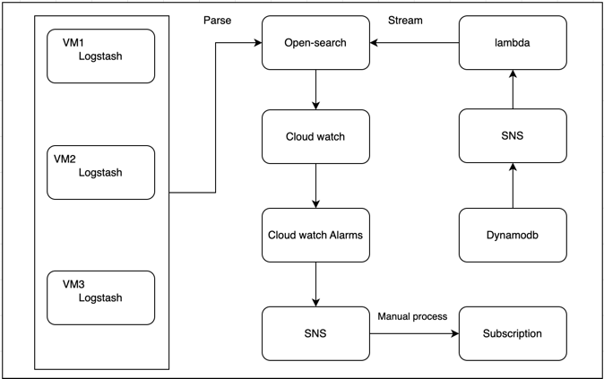

Streaming your DynamoDB data to ElasticSearch for enhanced Analytics and Alerting based on node details.
###Overview:
Exporting logs, metrics,dynamodb-indexes to Elasticsearch. 

1. Target Architecture
2. Setting up our ElasticSearch domain
3. Forwarding our data via DynamoDB Streams & Lambda
4. Alerting through cloudwatch alarms based on thresholds

###Prerequisites:
1. Should install `npm` latest verison.
2. install cdktf-cli: `npm install --global cdktf-cli@latest`

Architecture:


1. Init you project using cdktf

```
cdktf init
```

2. Install aws provider

```
cdktf provider add "aws@~>4.0"
```

3. Needs upload lambda layers and source code, please change absolute path of .zip in `modules/lambda/main.tf`


4. preview all values: 
 
```
cdktf plan
```

5. Deploy all resources using 
 
```
cdktf deploy 
```

6. Destroying or cleaning resources:

```
cdktf destroy 
```


###Reference links
[1] https://developer.hashicorp.com/terraform/tutorials/cdktf/cdktf-install

[2] https://github.com/hashicorp/terraform-cdk/issues/294

[3]https://developer.hashicorp.com/terraform/cdktf/create-and-deploy/configuration-file 

[4]https://developer.hashicorp.com/terraform/cdktf

[5]https://towardsaws.com/streaming-your-dynamodb-data-to-elasticsearch-for-enhanced-analytics-24862f67f09c

[6]https://github.com/dubiety/terraform-aws-elasticsearch-cloudwatch-sns-alarms/tree/v3.0.3

[7]https://instil.co/blog/opensearch-with-dynamodb/

